# t2med-self

Ein Check-in-Terminal für die Arztpraxis: Patienten lesen ihre Gesundheitskarte ein, prüfen ihre Kontaktdaten, unterschreiben bei Bedarf die Datenschutzerklärung und können ein freiwilliges Patientenfoto aufnehmen. Die Anwendung trägt sie entsprechend Termin und Anliegen in die konfigurierten t2med-Wartebereiche ein.

> **Benutzung auf eigene Gefahr.** Das System greift lesend und schreibend auf t2med zu. Änderungen an der t2med-Schnittstelle können einzelne Funktionen oder das gesamte System außer Betrieb setzen.

<a href="fotos/IMG_4390.jpeg">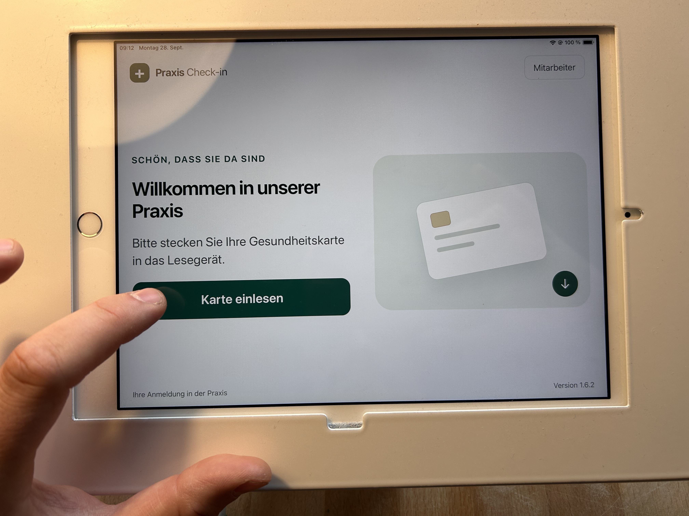</a>

*Dokumentationsstand: 1.6.4. Die Fotos zeigen Version 1.6.2; einzelne Oberflächendetails unterscheiden sich.*

## Downloads

| Datei | Inhalt |
|---|---|
| [Installationsarchiv 1.6.4](t2med-checkin-1.6.4.tar.gz) · [SHA-256](t2med-checkin-1.6.4.tar.gz.sha256) | Vollständige Anwendung einschließlich Konfigurationsvorlage und SMS-Pins |
| [SMS erlaubt](t2med-checkin-1.6.4/pins/SMS-erlaubt.png?raw=true) · [SMS nicht erlaubt](t2med-checkin-1.6.4/pins/SMS-nicht-erlaubt.png?raw=true) | Die beiden Pins einzeln als PNG |
| [SMS-Pins als ZIP](t2med-checkin-1.6.4/pins/sms-pins.zip) | Nur die beiden PNG-Dateien zum Ergänzen eines vorhandenen Katalogs |
| [Ergänztes symbole.zip](t2med-checkin-1.6.4/pins/symbole.zip) | Vollständiger Symbolkatalog aus dem erprobten Aufbau, Stand 27.09.2026; Hinweise zur Verwendung in der [Pin-Anleitung](t2med-checkin-1.6.4/pins/README.md) beachten |

Auf GitHub bei einer Dateivorschau **„Download raw file“** wählen; einzelne PNGs lassen sich auch über die Bildansicht speichern.

## Voraussetzungen und Hardware

- **Server:** Linux mit Netzwerkzugang zu t2med. Der Installer ist für Debian 12/13 und Raspberry Pi OS Bookworm/Trixie ausgelegt. Die Einrichtung ist auch auf einem bereits für [fragebogenpi.de](https://fragebogenpi.de) eingesetzten Raspberry Pi möglich.
- **Terminal:** iPad der 7. oder 8. Generation im Querformat; für den gezeigten Aufbau wird ein günstiges Refurbished-Gerät verwendet. WLAN und dauerhafte Stromversorgung vorsehen.
- **Kartenleser:** Ein in t2med eingerichteter und erreichbarer eGK-Kartenleser.
- **Gehäuse:** [PureMounts Tablet-Halterung](https://www.amazon.de/dp/B0C9F18Q95), abschließbares Stahlgehäuse, VESA 75 × 75 mm.
- **Aufstellung:** Am besten auf einem Tisch so positionieren, dass andere Personen den Bildschirm nicht einsehen können. Tischhöhe und Erreichbarkeit so wählen, dass sich das Terminal auch im Sitzen gut bedienen lässt – insbesondere für kleinere Menschen und Menschen im Rollstuhl.

Im gezeigten Aufbau wurden die beiliegenden Kunststoffblenden aus optischen Gründen weggelassen. Das mitgelieferte Schaumpolster wurde halbiert und so eingesetzt, dass das iPad im Gehäuse eingeklemmt wird.

<a href="fotos/IMG_4405.jpeg">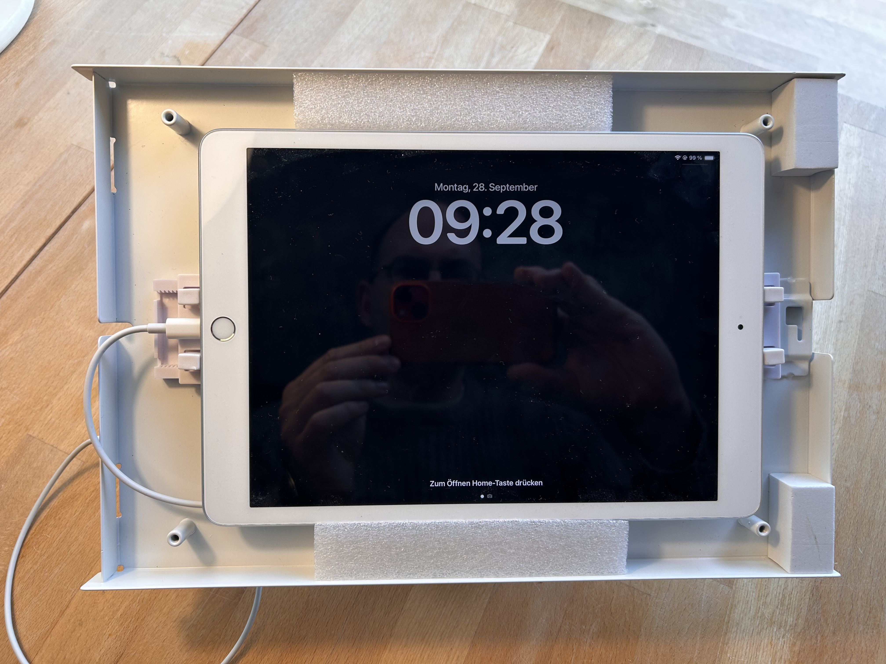</a>

## Bildergeschichte: Vom Einlesen bis zum Abschluss

So sieht ein vollständiger Beispielablauf am Terminal aus. Je nach Termin, vorhandenen Angaben und Einwilligungen entfallen einzelne Schritte. Alle Bilder lassen sich durch Anklicken vergrößern.

[Direkt zur Einrichtung](#einrichtung)

### 1. Gesundheitskarte einstecken

Der Patient steckt seine Gesundheitskarte in das Lesegerät und tippt auf **„Karte einlesen“**.

<a href="fotos/IMG_4390.jpeg"></a>

### 2. Die Karte wird eingelesen

Das Terminal liest die Karte und ruft die für die Anmeldung benötigten Angaben aus t2med ab. Währenddessen bittet es um einen Moment Geduld.

<a href="fotos/IMG_4391.jpeg"></a>

### 3. Kontaktdaten prüfen

Stimmen Telefonnummern, E-Mail und die Adresse auf der Karte noch? Der Patient kann Angaben ergänzen oder korrigieren. Alle Angaben sind freiwillig; leere Felder lassen vorhandene Werte unverändert. Eine abweichende Adresse wird als Hinweis für das Praxisteam festgehalten.

<a href="fotos/IMG_4392.jpeg">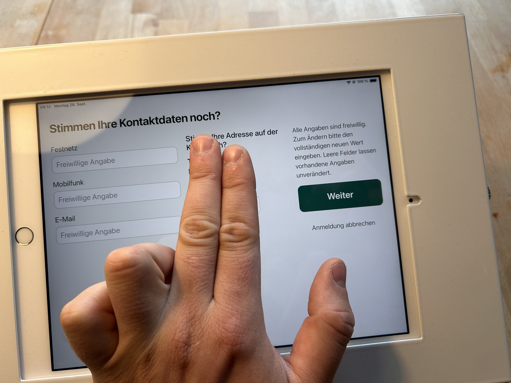</a>

### 4. Eine Telefonnummer ergänzen

Für Telefonnummern öffnet sich eine große Zifferntastatur. Der Patient gibt die vollständige neue Nummer ein und bestätigt mit **„Fertig“**.

<a href="fotos/IMG_4393.jpeg">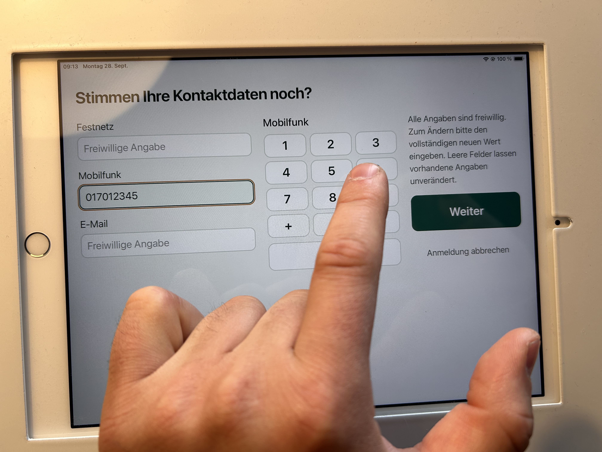</a>

### 5. Das Anliegen auswählen

Falls im jeweiligen Ablauf vorgesehen, fragt das Terminal nach dem Besuchsgrund: ein akutes Problem, nur die Karte einlesen oder ein anderes Anliegen. Termin und Auswahl bestimmen den weiteren Weg.

<a href="fotos/IMG_4394.jpeg">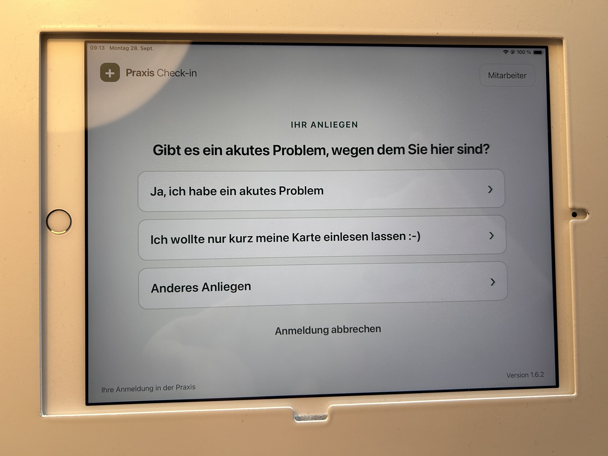</a>

### 6. Kurz beschreiben, worum es geht

Bei einem akuten Problem oder einem anderen Anliegen kann der Patient eine kurze Nachricht für das Praxisteam eingeben.

<a href="fotos/IMG_4395.jpeg">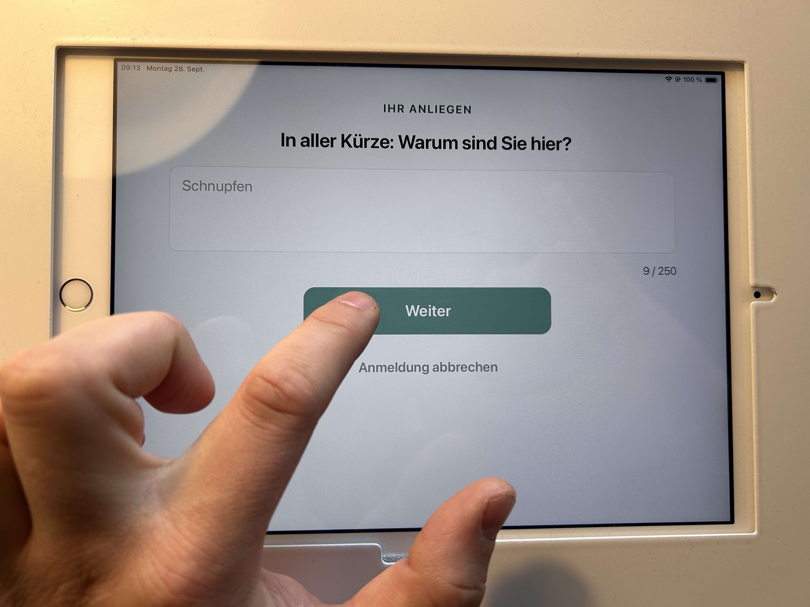</a>

### 7. Datenschutzerklärung unterschreiben

Wenn eine neue Unterschrift benötigt wird, erscheint die Datenschutzerklärung. Der Patient liest den Text und unterschreibt mit dem Finger. Die zusätzlichen Einwilligungen für E-Mail und SMS sind unabhängig voneinander freiwillig.

<a href="fotos/IMG_4396.jpeg">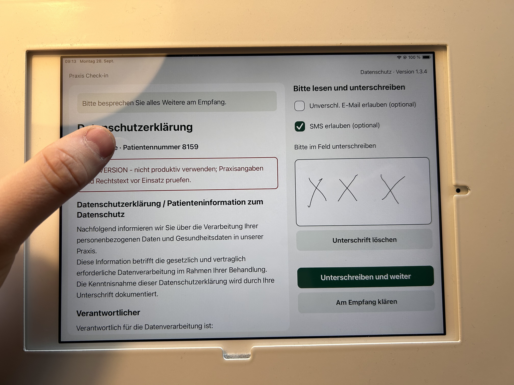</a>

### 8. Über das Patientenfoto entscheiden

Das Terminal fragt, ob ein Foto für die Patientenakte aufgenommen werden darf. Der Patient kann zustimmen oder ohne Foto fortfahren.

<a href="fotos/IMG_4397.jpeg">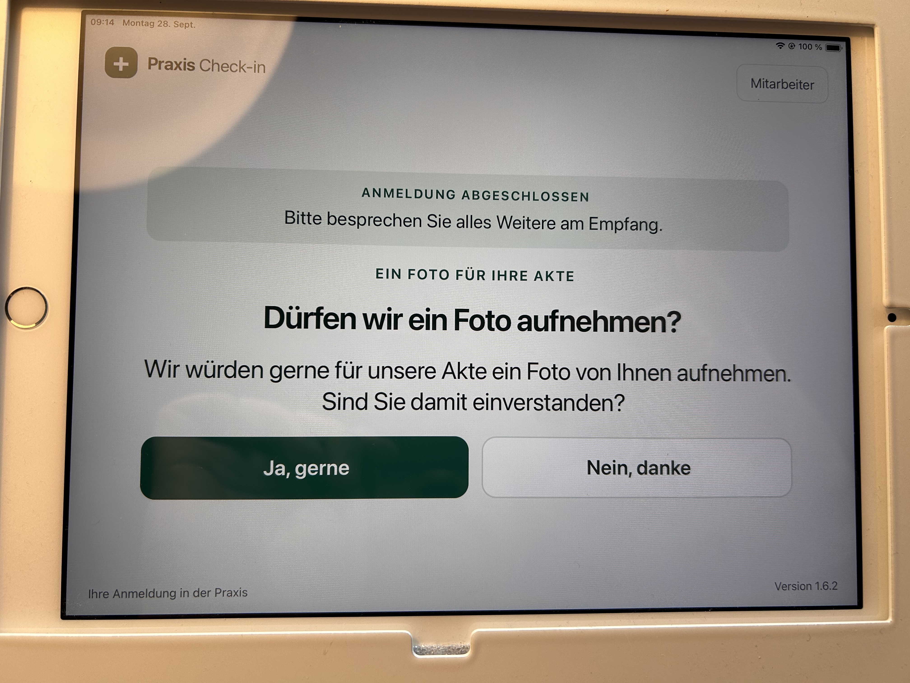</a>

### 9. Das Foto aufnehmen

In der Kameravorschau richtet der Patient sein Gesicht am angezeigten Rahmen aus und drückt den Auslöser.

<a href="fotos/IMG_4398.jpeg">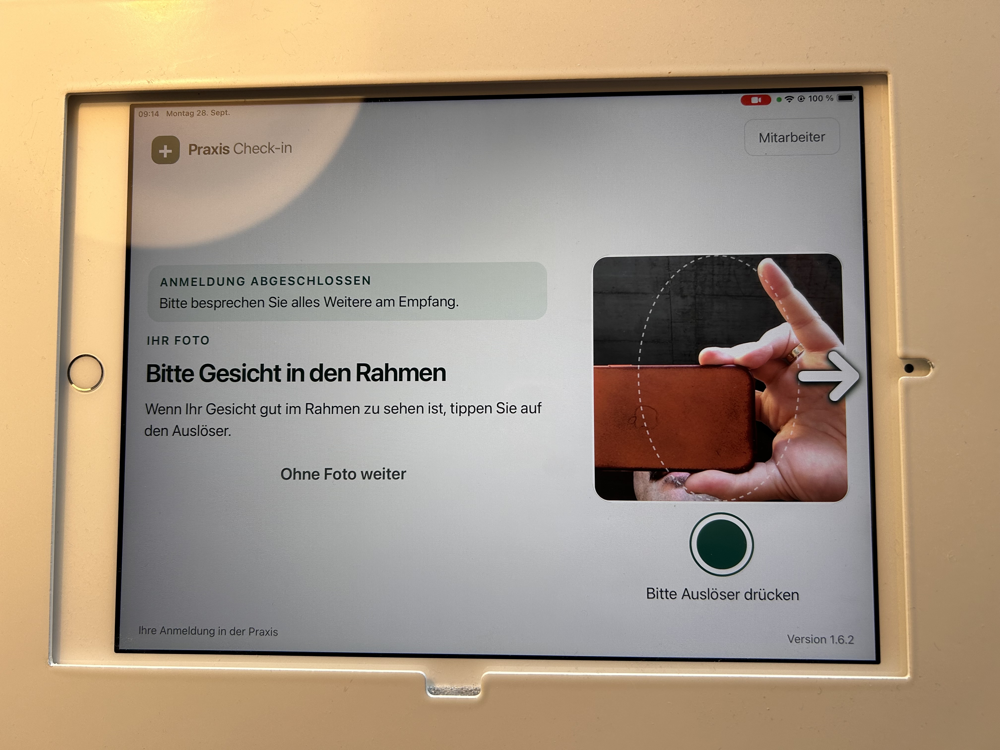</a>

### 10. Den Bildausschnitt anpassen

Das Bild lässt sich mit einem Finger verschieben und mit zwei Fingern vergrößern oder verkleinern. Anschließend bestätigt der Patient den gewünschten Ausschnitt.

<a href="fotos/IMG_4399.jpeg">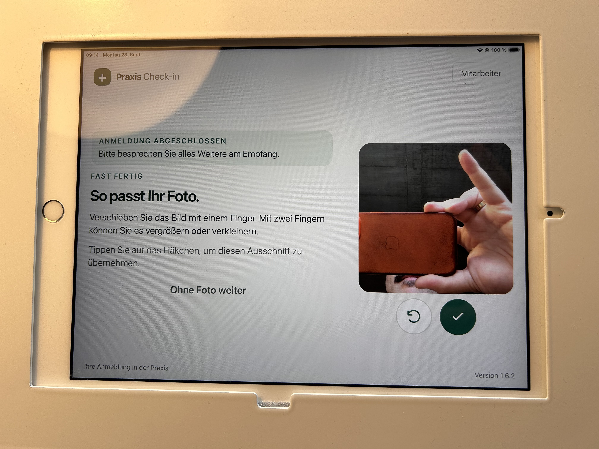</a>

### 11. Fertig – und die Karte mitnehmen

Die Abschlussseite nennt den nächsten Schritt und erinnert an die Gesundheitskarte. Im gezeigten Beispiel geht es zum Empfang; je nach Termin und Zuordnung kann der Patient direkt ins Wartezimmer gehen.

<a href="fotos/IMG_4400.jpeg">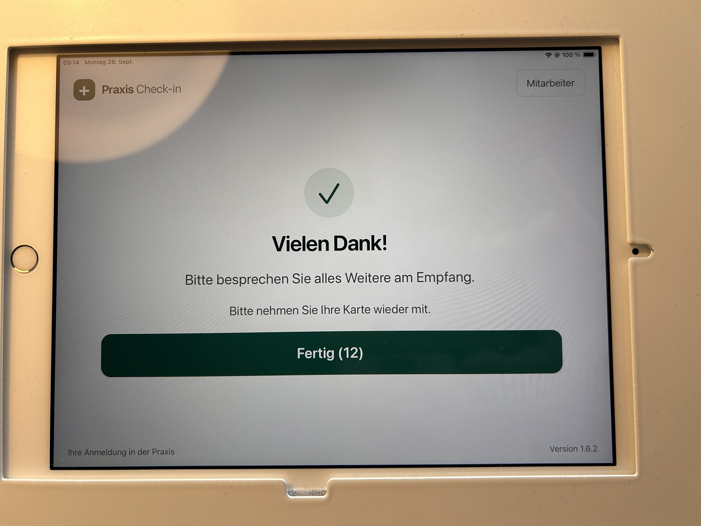</a>

### 12. Das Ergebnis in t2med

Für das Praxisteam stehen die übertragenen Angaben in t2med bereit. Das Bild zeigt den Eintrag zur Telefonnummer und die gespeicherte Datenschutzerklärung einschließlich des SMS-Pins. Der Patient wird außerdem dem für seinen Ablauf konfigurierten Wartebereich zugeordnet.

<a href="fotos/IMG_4403.jpeg">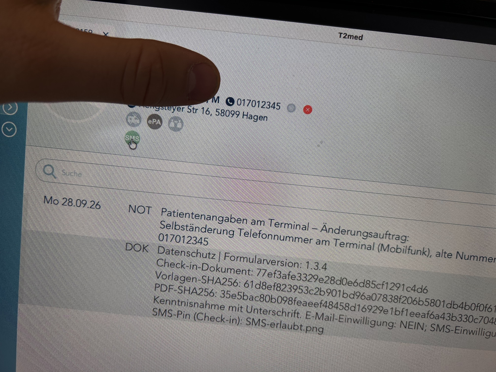</a>

## Einrichtung

### 1. t2med-Benutzer anlegen

Für das Terminal einen t2med-Benutzer einrichten. Über dessen Konto arbeitet das Gerät nach der Mitarbeiteranmeldung. Als Vorlage dient der folgende Screenshot mit den Rechtebereichen **eAkte, Patient, Self-CheckIn, Terminkalender und Wartezimmer**. Die einzelnen Unterrechte sind darin eingeklappt.

<a href="fotos/Rechte%20t2med-benutzer.png"></a>

Schreibende Rechte werden insbesondere benötigt, um:

- Telefonnummern und E-Mail-Adressen einzutragen oder zu korrigieren,
- unterschriebene Datenschutzerklärungen und zugehörige Einwilligungen zu speichern,
- Patientenfotos in t2med abzulegen,
- Patienten in Wartebereiche zu setzen und zugehörige Notizen zu hinterlegen.

### 2. Server installieren

Das [Release-Paket 1.6.4](t2med-checkin-1.6.4.tar.gz) auf den Linux-Server übertragen, entpacken und im vollständigen Release-Verzeichnis starten:

```bash
sudo bash install.sh
```

Der Installer richtet die benötigten Pakete und einen eigenen HTTPS-Dienst ein. Er fragt t2med-Server, Zugangsdaten, Kartenleser, Arztrolle, Behandlungsort und Wartebereiche ab. Abschließend legt man die vom iPad erreichbare Serveradresse und den HTTPS-Port fest; vorgeschlagen wird Port **8443**. Für die Installation werden sudo-Rechte und Zugang zu den Paketquellen benötigt.

Die aktive Konfiguration liegt auf dem **Linux-Server** unter **`/etc/t2med-checkin/config.toml`**. Hier werden unter anderem Wartebereiche, Texte, Zeitlimits, Kamera und die einzelnen Funktionen eingestellt. Die [Standardkonfiguration](docs/config.standard.toml) dokumentiert den verwendeten Praxisaufbau; Server, Kartenleser und Kontext-IDs an die eigene Installation anpassen. Die [Konfigurationsübersicht](docs/KONFIGURATION.md) erklärt alle Optionen, das Bearbeiten und die anschließende Prüfung.

**Die integrierte Fragebogenfunktion funktioniert technisch**, einschließlich Auswertung, Folgefragebögen und Speicherung in t2med. Sie hat sich im Usertest am Check-in-Terminal jedoch nicht bewährt und wird im hier beschriebenen Praxisablauf nicht genutzt. Medizinische Anamnesefragebögen sollen auf einem separaten Tablet im Wartebereich ausgefüllt werden, beispielsweise mit [fragebogenpi.de](https://fragebogenpi.de). Im dokumentierten Standard bleibt die Funktion technisch aktiviert; **leere Startlisten verhindern, dass Fragebögen gestartet werden**:

```toml
[questionnaires]
enabled = true
new_patient_forms = ""
existing_patient_forms = ""
```

Die Datenschutzerklärung bleibt davon unabhängig aktiv. Ihre Vorlage liegt standardmäßig unter **`/etc/t2med-checkin/formulare/datenschutz.yaml`**. Dort Praxisangaben und Textabschnitte bearbeiten; nach abgeschlossener Anpassung den Testhinweis entfernen und die Formularversion pflegen. Die [Schrittanleitung zur Datenschutzvorlage](docs/DATENSCHUTZVORLAGE.md) zeigt die betreffenden Felder, ein Beispiel und die Prüfung.

**SMS-Pins bei t2med vor 26.11:** Die beiden PNG-Dateien müssen unter `/opt/t2med/server/pins/` sowohl einzeln als auch im dortigen `symbole.zip` vorhanden sein. Zuerst den Pin-Ordner sichern, dann die Symbole ergänzen und den t2med-Server neu starten. Die [Schrittanleitung mit Downloads](t2med-checkin-1.6.4/pins/README.md) beschreibt die Einrichtung unter Erhalt vorhandener Symbole. Der Check-in-Installer erledigt diesen Schritt nicht. Soll auf SMS-Pins verzichtet werden, `sms_pin_allowed` und `sms_pin_denied` im Abschnitt `[privacy]` jeweils auf `""` setzen.

Im dokumentierten Standard ist die SQL-Änderung des Kartenvorlagedatums auf **01.01.1990 eingeschaltet**, mit `sql.mode = "local"`. Dies setzt die t2med-Datenbank auf demselben Rechner voraus. Auf einem separaten Server oder Raspberry Pi den SQL-Zugang über `ssh` oder `tcp` einrichten oder diese Zusatzfunktion gezielt ausschalten; siehe [Konfiguration](docs/KONFIGURATION.md).

### 3. iPad vorbereiten

1. Die vom Installer ausgegebene Adresse in **Safari** öffnen, etwa `https://CHECKIN-HOST:8443/`. Den bei der Einrichtung festgelegten Hostnamen verwenden.
2. Beim ersten Aufruf die Zertifikatswarnung für den eigenen Check-in-Server einmal mit **„Trotzdem verbinden“** bestätigen. Im erprobten Aufbau ist keine zusätzliche Zertifikatsinstallation auf dem iPad erforderlich.
3. Im Teilen-Menü **„Zum Home-Bildschirm“** wählen und die Anwendung anschließend über dieses Symbol starten.
4. **Autokorrektur sowie Text- und Wortvorschläge deaktivieren.**
5. **Automatische Helligkeit deaktivieren und die Helligkeit fest auf Maximum stellen.** Im Praxistest verbessert die Beleuchtung durch das Display die Qualität der Patientenfotos erheblich.
6. **Geführten Zugriff** aktivieren und dafür **keine automatische Bildschirmsperre** einstellen.
7. Als Praxisteam das Gerät anmelden, die Kamerafreigabe erteilen und den **geführten Zugriff tatsächlich starten**. Erst während dieser Sitzung bleibt das Display mit dieser Einstellung dauerhaft eingeschaltet.

**Aus Sicherheitsgründen muss das Praxisteam das Gerät spätestens alle zwölf Stunden erneut mit dem t2med-Benutzer anmelden.**

| Zum Home-Bildschirm hinzufügen | Geführten Zugriff starten |
|---|---|
| [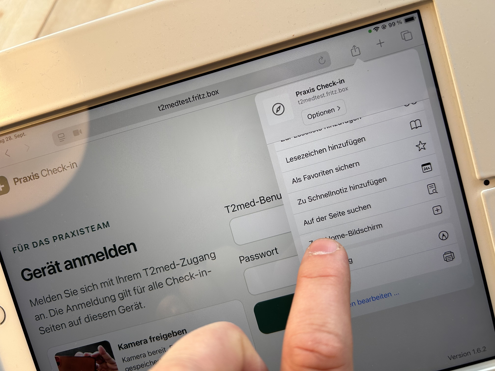](fotos/IMG_4406.jpeg) | [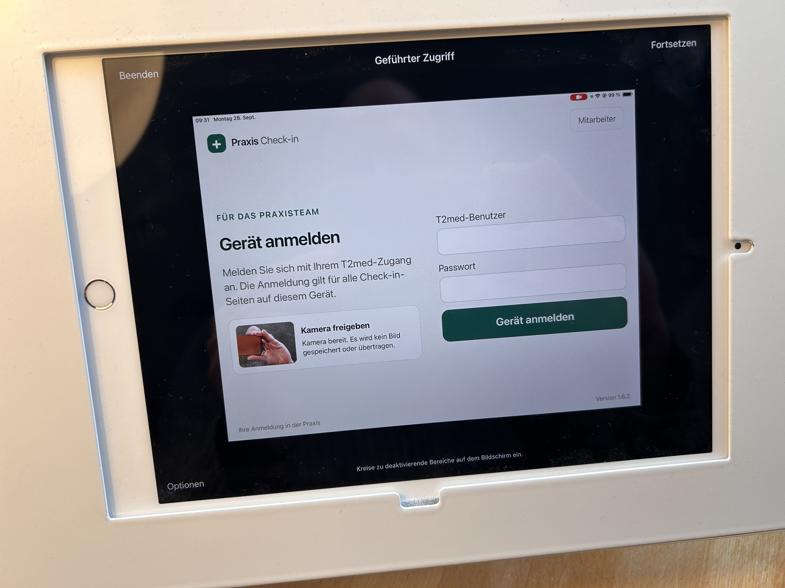](fotos/IMG_4407.jpeg) |

## Bedienung im Praxisalltag

Das Praxisteam meldet das Gerät mit dem eingerichteten t2med-Benutzer an. Bei aktivierter Fotofunktion erscheint eine kleine Kameravorschau zur Freigabe; dabei wird noch kein Foto gespeichert. Die Anmeldung gilt **höchstens zwölf Stunden**, danach ist eine erneute Mitarbeiteranmeldung nötig.

Über **„Mitarbeiter“** auf der Startseite lässt sich das Gerät abmelden. Dafür sind drei Bestätigungen erforderlich. Bis zur erneuten Anmeldung ist kein Check-in möglich.

### Mitarbeiteranmeldung und Abmeldung

| Anmeldung und Kamerafreigabe | Erste Abmeldebestätigung |
|---|---|
| [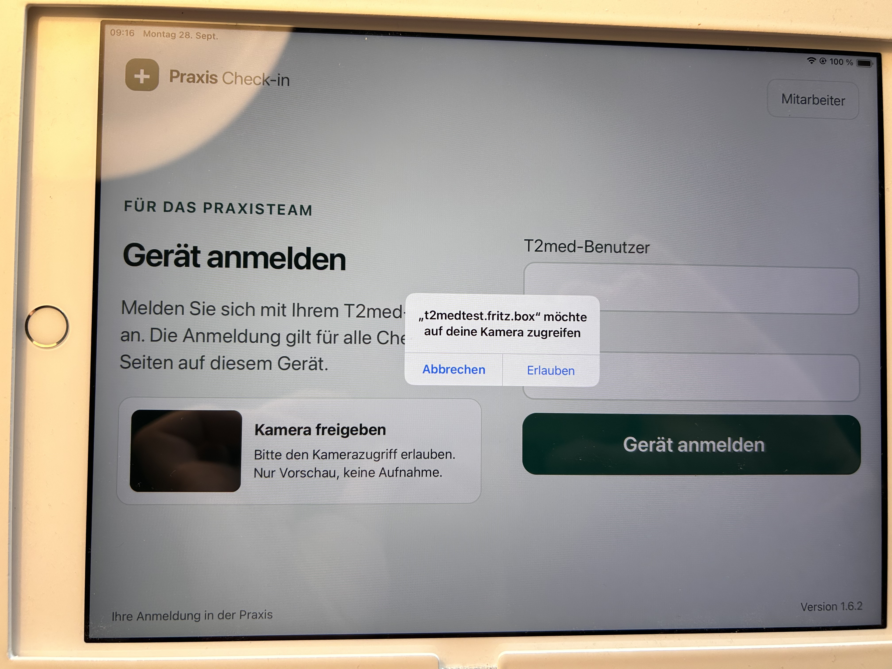](fotos/IMG_4402.jpeg) | [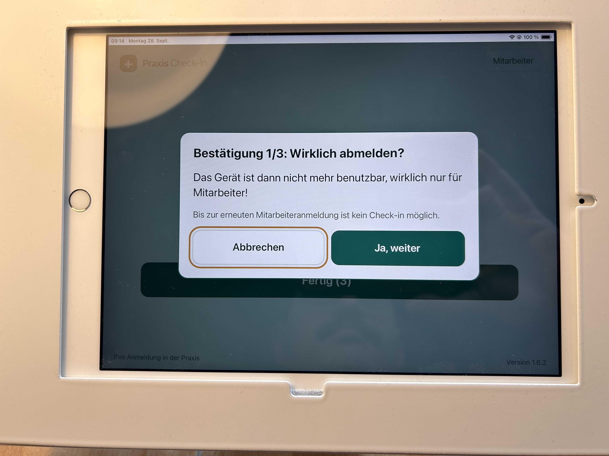](fotos/IMG_4401.jpeg) |

Den Patientenablauf zeigt die [Bildergeschichte vor der Einrichtung](#bildergeschichte-vom-einlesen-bis-zum-abschluss).

## Betrieb und technische Grundlage

Das iPad zeigt eine Webanwendung an. Auf dem Linux-Server laufen PHP und ein eigener HTTPS-Webserver; die Anwendung kommuniziert mit t2med über dessen Schnittstellen. Die technischen Einzelheiten ergeben sich aus dem [Quellcode](t2med-checkin-1.6.4/src/).

Updates werden aus dem vollständigen neuen Release-Verzeichnis mit `sudo bash install.sh --resume` installiert. Anschließend die Anwendung auf dem iPad vollständig schließen und neu öffnen. Nach Änderungen an t2med den Ablauf erneut prüfen. Das vom Installer erzeugte Serverzertifikat ist ein Jahr gültig und muss vor Ablauf erneuert werden.

Bei Fehlermeldungen oder unklaren Übertragungen den Vorgang am Empfang prüfen und bereits gespeicherte Daten in t2med abgleichen. Offene Datenschutzübertragungen sind in der [Anleitung zum Datenschutz-Abschluss](t2med-checkin-1.6.4/docs/DATENSCHUTZ-ABSCHLUSS.md) beschrieben.
